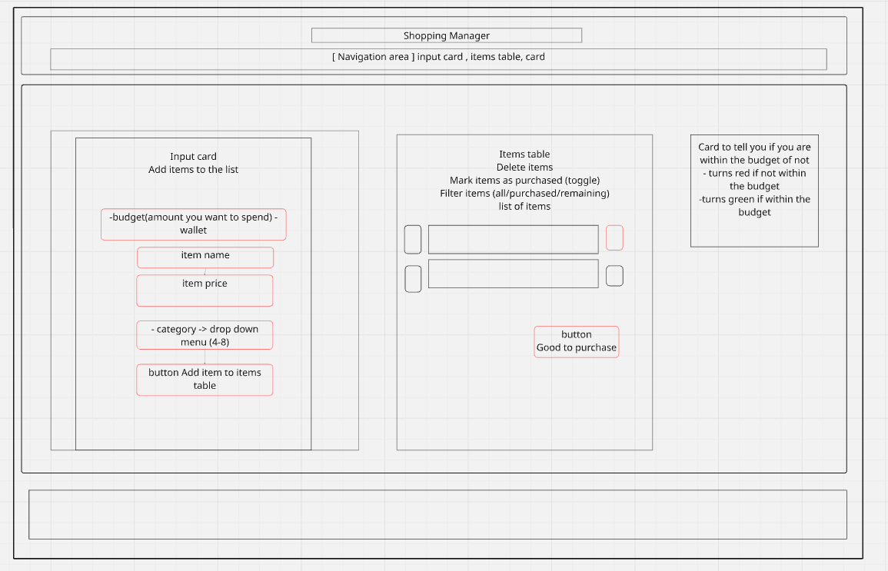

# Shopping List Manager - MVP

## Overview

A minimal viable product (MVP) for a shopping list manager that helps users track their purchases against a set budget. The app allows users to add items, categorize them, mark purchases, and monitor their spending.

## Core Features

### 1. Input Card

- **Budget Input Field**: Numeric field to set spending limit
- **Item Entry Fields**:
  - Item name (text input)
  - Price (numeric input)
  - Category dropdown (minimum 4 categories: Groceries, Clothing, Electronics, Household)
- **Add Item Button**: Submits items to the table

### 2. Items Table

- Displays all added items with columns:
  - Name
  - Price
  - Category
  - Status (Purchased/Remaining)
- **Row Actions**:
  - Delete button to remove items
  - Toggle button/checkbox to mark items as purchased
- **Filter Dropdown**: Shows All/Purchased/Remaining items

### 3. Budget Card

- **Dynamic Total Calculation**: Automatically sums prices
- **Visual Indicator**:
  - Green: Total within budget
  - Red: Total exceeds budget
- **"Good to Purchase" Button**: Basic implementation that displays a confirmation message

## Technical Requirements

- React.js for frontend components
- State management for items and budget
- Responsive design
- Local storage persistence (optional for MVP)

## Contributing

Pull requests are welcome. For major changes, please open an issue first to discuss what you would like to change.

Header
Footer
InputCard-addItem button
TableCard-DeleteButton
good to purchase -- child to tableCard component
Notifaction-within budget or not
